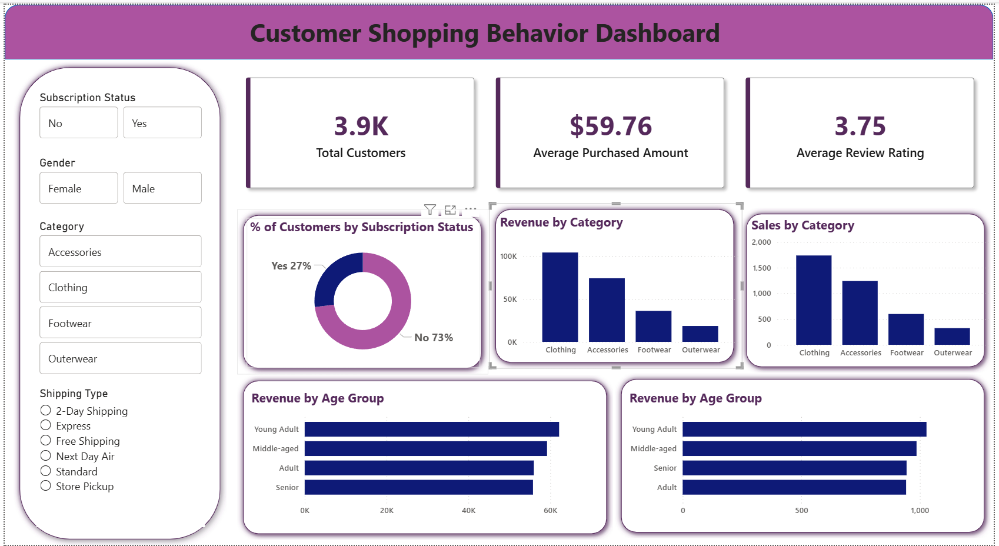

# Customer-Shopping-Behavior-Analysis

📌 Project Overview

This project analyzes customer purchase data to uncover insights into buying behavior, product performance, and revenue trends. The goal is to support data-driven business decisions using Python, SQL Server, and Power BI.

📊 Dataset Details

Total Records: 3,900+ transactions

Features: 18 columns (customer demographics, purchase details, behavior)

Data Issues: 37 missing values handled during preprocessing

🛠️ Tools & Technologies

Python – Data cleaning & preprocessing

SQL Server (T-SQL) – Data querying & analysis

Power BI – Dashboard & data visualization

🔍 Key Analysis Performed

-Data cleaning and handling missing values

-Exploratory Data Analysis (EDA)

-Customer segmentation (Loyal, Returning, New)

-Revenue analysis by gender and age group

-Product performance analysis (top-rated & most purchased items)

-Discount impact on customer spending

-Shipping method analysis

📈 Key Insights

-Male customers contributed ~68% of total revenue

-Discounted purchases showed higher average spending (~$59.76)

-Express shipping users had higher purchase value

-Loyal customers formed the majority segment (3,116 users)

-Young adults generated the highest revenue among age groups

💡 Business Recommendations

-Introduce loyalty programs to retain high-value customers

-Optimize discount strategy to balance revenue and profit

-Promote subscription plans for repeat customers

Focus marketing on high-revenue segments

## 📊 Dashboard Preview

